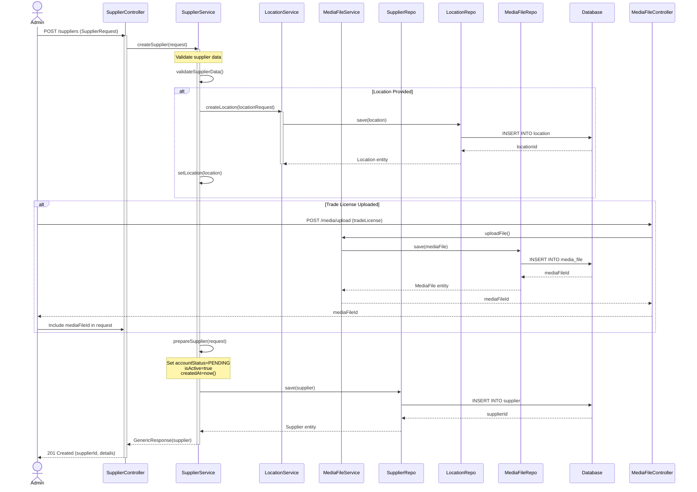
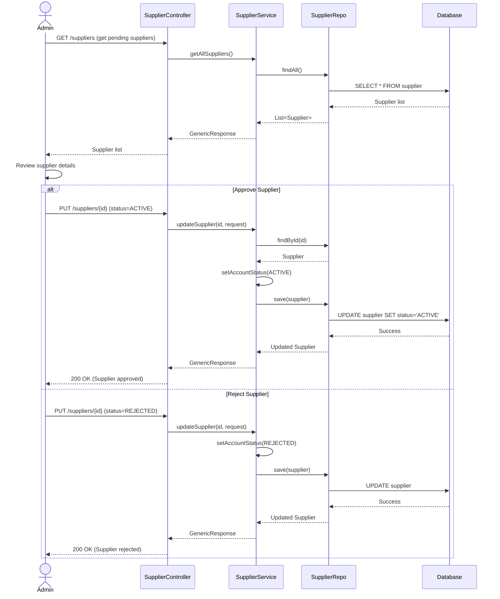
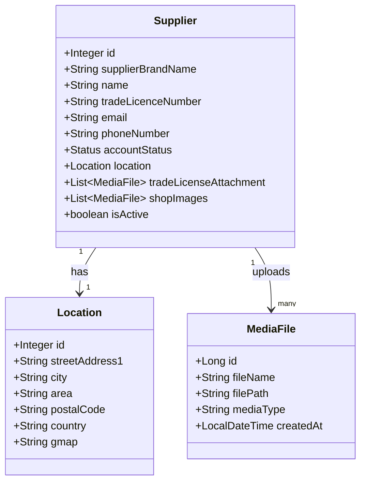

# Supplier Onboarding Flow - UML Sequence Diagram

## 1. Supplier Registration and Onboarding

```mermaid
sequenceDiagram
    actor Admin
    participant SupplierController
    participant SupplierService
    participant LocationService
    participant MediaFileService
    participant SupplierRepo
    participant LocationRepo
    participant MediaFileRepo
    participant Database

    Admin->>SupplierController: POST /suppliers (SupplierRequest)
    activate SupplierController

    SupplierController->>SupplierService: createSupplier(request)
    activate SupplierService

    Note over SupplierService: Validate supplier data
    SupplierService->>SupplierService: validateSupplierData()

    alt Location Provided
        SupplierService->>LocationService: createLocation(locationRequest)
        activate LocationService
        LocationService->>LocationRepo: save(location)
        LocationRepo->>Database: INSERT INTO location
        Database-->>LocationRepo: locationId
        LocationRepo-->>LocationService: Location entity
        deactivate LocationService
        SupplierService->>SupplierService: setLocation(location)
    end

    alt Trade License Uploaded
        Admin->>MediaFileController: POST /media/upload (tradeLicense)
        MediaFileController->>MediaFileService: uploadFile()
        MediaFileService->>MediaFileRepo: save(mediaFile)
        MediaFileRepo->>Database: INSERT INTO media_file
        Database-->>MediaFileRepo: mediaFileId
        MediaFileRepo-->>MediaFileService: MediaFile entity
        MediaFileService-->>MediaFileController: mediaFileId
        MediaFileController-->>Admin: mediaFileId
        Admin->>SupplierController: Include mediaFileId in request
    end

    SupplierService->>SupplierService: prepareSupplier(request)
    Note over SupplierService: Set accountStatus=PENDING<br/>isActive=true<br/>createdAt=now()

    SupplierService->>SupplierRepo: save(supplier)
    SupplierRepo->>Database: INSERT INTO supplier
    Database-->>SupplierRepo: supplierId
    SupplierRepo-->>SupplierService: Supplier entity

    SupplierService-->>SupplierController: GenericResponse(supplier)
    deactivate SupplierService
    SupplierController-->>Admin: 201 Created (supplierId, details)
    deactivate SupplierController
```

## 2. Supplier Approval Workflow

```mermaid
sequenceDiagram
    actor Admin
    participant SupplierController
    participant SupplierService
    participant SupplierRepo
    participant Database

    Admin->>SupplierController: GET /suppliers (get pending suppliers)
    SupplierController->>SupplierService: getAllSuppliers()
    SupplierService->>SupplierRepo: findAll()
    SupplierRepo->>Database: SELECT * FROM supplier
    Database-->>SupplierRepo: Supplier list
    SupplierRepo-->>SupplierService: List<Supplier>
    SupplierService-->>SupplierController: GenericResponse
    SupplierController-->>Admin: Supplier list

    Admin->>Admin: Review supplier details

    alt Approve Supplier
        Admin->>SupplierController: PUT /suppliers/{id} (status=ACTIVE)
        SupplierController->>SupplierService: updateSupplier(id, request)
        SupplierService->>SupplierRepo: findById(id)
        SupplierRepo-->>SupplierService: Supplier
        SupplierService->>SupplierService: setAccountStatus(ACTIVE)
        SupplierService->>SupplierRepo: save(supplier)
        SupplierRepo->>Database: UPDATE supplier SET status='ACTIVE'
        Database-->>SupplierRepo: Success
        SupplierRepo-->>SupplierService: Updated Supplier
        SupplierService-->>SupplierController: GenericResponse
        SupplierController-->>Admin: 200 OK (Supplier approved)
    else Reject Supplier
        Admin->>SupplierController: PUT /suppliers/{id} (status=REJECTED)
        SupplierController->>SupplierService: updateSupplier(id, request)
        SupplierService->>SupplierService: setAccountStatus(REJECTED)
        SupplierService->>SupplierRepo: save(supplier)
        SupplierRepo->>Database: UPDATE supplier
        Database-->>SupplierRepo: Success
        SupplierRepo-->>SupplierService: Updated Supplier
        SupplierService-->>SupplierController: GenericResponse
        SupplierController-->>Admin: 200 OK (Supplier rejected)
    end
```

## Entity Relationship

```mermaid
classDiagram
    class Supplier {
        +Integer id
        +String supplierBrandName
        +String name
        +String tradeLicenceNumber
        +String email
        +String phoneNumber
        +Status accountStatus
        +Location location
        +List~MediaFile~ tradeLicenseAttachment
        +List~MediaFile~ shopImages
        +boolean isActive
    }

    class Location {
        +Integer id
        +String streetAddress1
        +String city
        +String area
        +String postalCode
        +String country
        +String gmap
    }

    class MediaFile {
        +Long id
        +String fileName
        +String filePath
        +String mediaType
        +LocalDateTime createdAt
    }

    Supplier "1" --> "1" Location : has
    Supplier "1" --> "many" MediaFile : uploads
```
